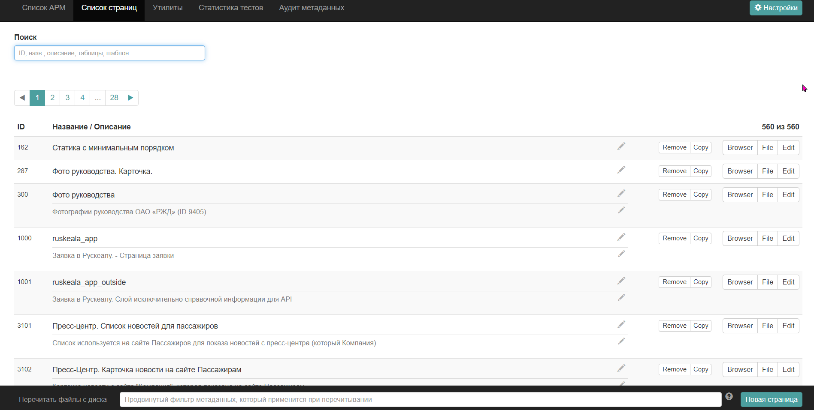
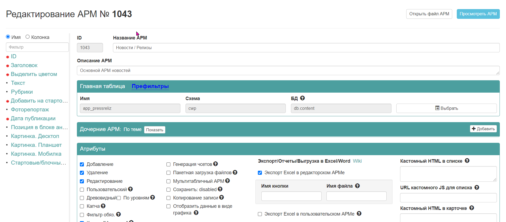
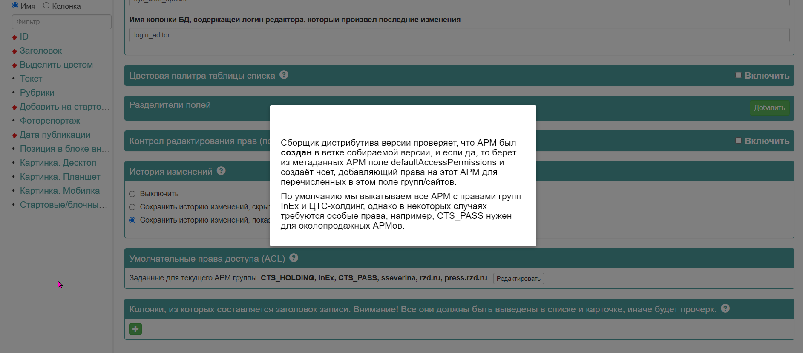
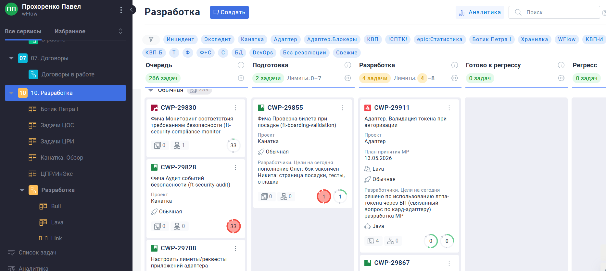
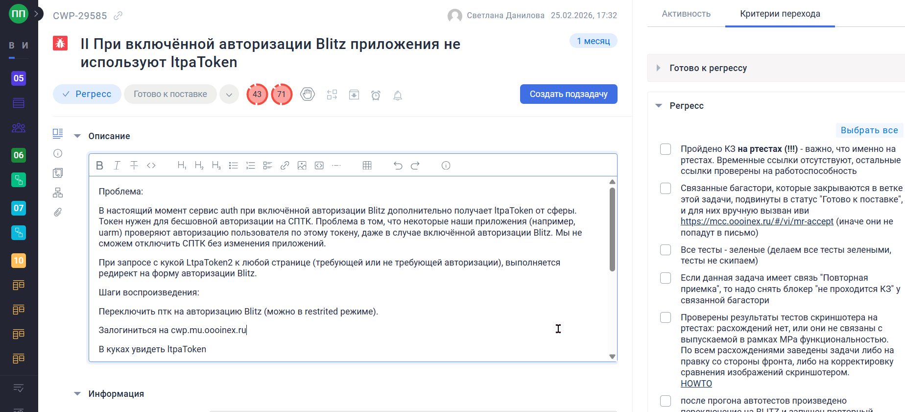
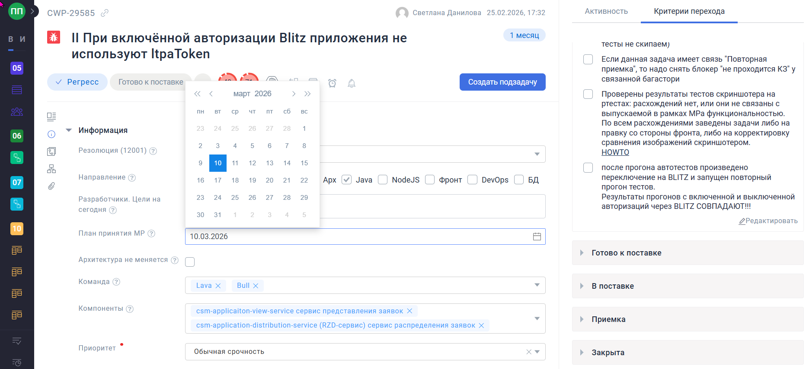
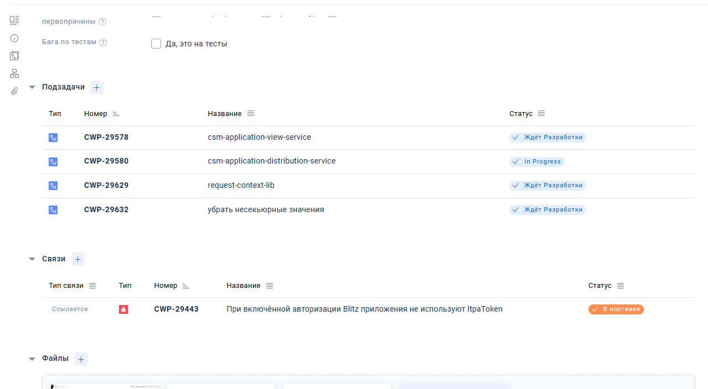
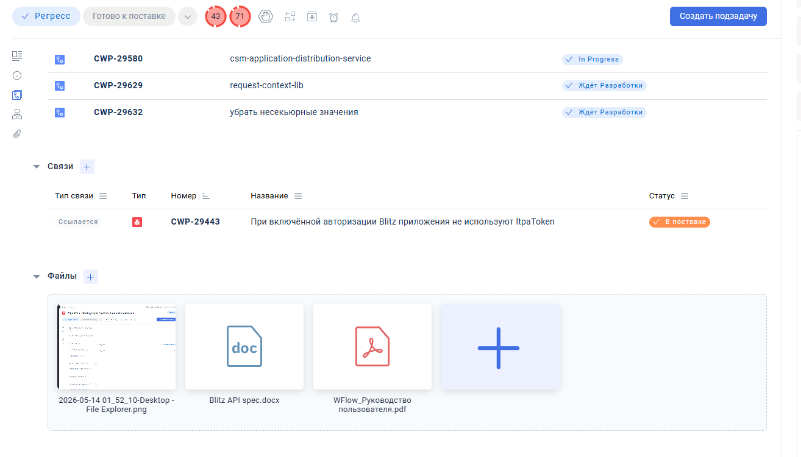
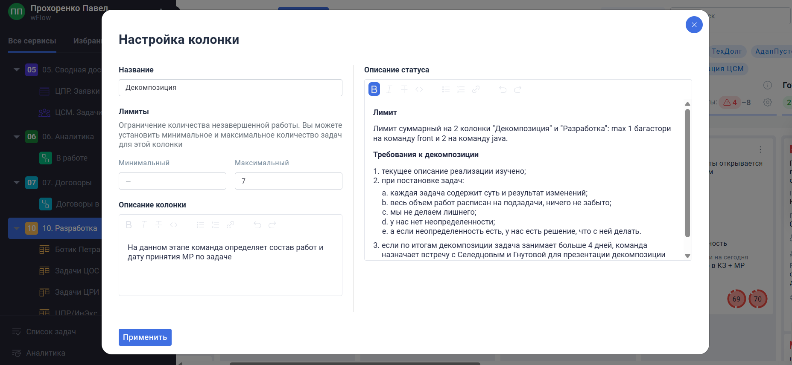

## Hello, world :-) My name is Pavel Prokhorenko

- I'm a JS/TS Full-Stack engineer based in Thailand
- My experience: hundreds of projects for Russian Railways in 2011-2026 as leading specialist
- rzd.ru is high-load (150K paid tickets/day, 20M+ visits/month)

---

## Table of Contents

- [Main Stack](#main-stack)
- [Projects & Achievements](#projects--achievements)
  - [High-Load Ticket Platform Migration](#high-load-ticket-platform-migration)
  - [RZD.ru Administrative App](#rzduadministrative-app)
  - [Electron Desktop App](#electron-desktop-app)
  - [Metadata Migration & Architecture](#metadata-migration--architecture)
  - [Advanced Kanban App](#advanced-kanban-app)
  - [Other Notable Work](#other-notable-work)
- [AI & Tools](#ai--tools)
- [My Priorities](#my-priorities)
- [Other Skills](#other-skills)
- [About Me](#me)

---

## Main Stack

- <b>Backend:</b>  (since 2016)
- <b>Frontend:</b>  (since 2016)
- <b>Desktop:</b>  (since 2018)

---

## Projects & Achievements

### High-Load Ticket Platform Migration

**Critical frontend migration of high-load ticket platform**

- **Scale:** ~150K paid tickets sold per day (~600/hour), 20+ million visits per month
- **Migration:** Custom jQuery-based framework → Vue 2
- **Impact:** My framework selection in 2017 became the company-wide standard
- **Complexity handled:**
  - Thousands of stations across 11 timezones
  - Intercity, international, and commuter trains
  - Tens of extra services
  - 3 languages support
  - Complex business logic implemented in frontend via JS and metadata-driven templates

> *Note: Ticket sales operations have since been transferred to another company; Git history remains as proof.*

---

### RZD.ru Administrative App

**Modern replacement for legacy administrative interface**

- **Before:** JSP-based IBM WebSphere stateful app (built by Java developers)
- **After:** Modern async Vue.js application
- **Architecture:** Dynamic component rendering based on declarative metadata
- **Result:** Significantly improved performance and developer experience

---

### Electron Desktop App

**Complex internal desktop application (Windows/Mac/Linux)**

Screenshots. Click to expand

**Key Features:**
- Metadata editors and validators
- Advanced metadata lists with filtering (including JSONPath support)
- Database connectivity (Oracle, PostgreSQL)
- SSH/SFTP support
- Multi-repository structure with integrated admin web-app

---

### Metadata Migration & Architecture

**Declarative system for administrative and user-facing interfaces**

The metadata system defines two formats for:
- **Administrative Forms** (1000+): Database-driven CRUD interfaces
- **User-Facing Pages** (500+): Data-fetching layer and component composition

<b>Metadata for Administrative Forms</b>. Click to expand

Our metadata files are declarative JSON descriptors that define the full lifecycle of an administrative interface (ARM) — from the underlying database table to the UI behavior in the browser.

Each descriptor maps database columns to field definitions specifying behavior across three contexts:
- **List view** (filtering, sorting, display)
- **Create form** (validation, defaults, dependencies)
- **Edit form** (read-only flags, dynamic fields, cross-table relations)

This eliminates repetitive CRUD boilerplate while maintaining consistency across 1000+ forms.

<b>Metadata for User-Facing Pages</b>. Click to expand

These page metadata files define the complete data-fetching layer declaratively (JSON-driven), eliminating custom backend code for each page.

**Components** are granular building blocks that:
- List exact fields to select
- Designate primary keys
- Define relations (one-to-one, one-to-many)
- Handle pagination and filtering

This replaces custom backend endpoints with declarative composition.

**Architecture Evolution:**
- **Before:** Quirky XML format with numerous workarounds and hacks
- **After:** Elegant, maintainable JSON structure with reduced overhead
- **Developed:**
  - Conversion scripts for both formats
  - Format editors in Electron app
  - Administrative front-end app for metadata management

---

### Advanced Kanban App

**Enterprise-grade project management frontend**

Screenshots. Click to expand

**Adoption & Scale:**
- Adopted company-wide: 70+ users migrated
- Deployed at Russian University of Transport: 200+ users

**Features:**
- Drag-and-drop Kanban boards
- Custom workflow configurations
- Custom issue fields
- Issue linking and file attachments
- Custom WYSIWYG JSON editor (built on TipTap/ProseMirror)

---

### Other Notable Work

 **5+ Backend Services**
- Express.js, PostgreSQL, Kafka, Elasticsearch
- Microservices architecture with scalable design

 **10+ Custom NPM Packages**
- Reusable Vue and Node utilities
- Used across multiple company projects

 **TypeScript Migrations & Coverage**
- Large-scale codebase modernization
- Type safety improvements

**Infrastructure & DevOps:**
- Complex build pipelines: Vite, Rollup, Webpack
- Docker containerization
- GitLab CI/CD

**Testing:**
- Unit & E2E tests (Jest for backend)
- Cypress for frontend and Electron apps

---

## AI & Tools

### Tools & Platforms
- VSCode with Continue
- Openrouter
- Claude Opus
- Deepseek (expert mode)
- Antigravity with Gemini
- Qwen Coder

### Usage Philosophy

I use AI thoughtfully and strategically:

**✓ Chat, questions & suggestions** — Always

**✓ Agentic jobs:**
- Build issues, tests, personal PoCs, scripts
- Exploration and rapid prototyping

**⚠ Production code:**
- Generally prefer hand-tailored solutions
- Excited about Specification Driven Development (SDD) approach
- AI-assisted when specs are clear

**✓ Boilerplate documentation** — Yes

**⚠ Other documentation** — Context-dependent

**✗ General text writing** — Rarely (prefer original voice)

---

## My Priorities

- **Teamwork ❤︎** — Collaborating, constantly learning while sharing knowledge with others
- **Building solutions** — Either maintainable apps for years ahead OR quick PoC/MVPs
- **Balance** — Business purposes (first priority), developer experience, and managing tech debt

---

## Other Skills

**Enterprise Stack** (legacy experience)
- Java, Oracle, IBM WebSphere, JSP, XSLT templates

**Mobile & Web**
- PWA development
- Quasar, Weex
- Interest in native Vue solutions (Lynx.js by ByteDance)

---

## Me

<table>
  <tr>
    <td width="200" style="padding-right: 20px; vertical-align: top;">
      
    </td>
    <td style="vertical-align: top;">
      <ul>
        <li>
          <b>Languages:</b> English (fluent), Russian (native), Deutsch & Français (rusty from university days 😊)
        </li>
        <li>
          <b>Location & Work:</b> Remote from Asia for 12+ years
        </li>
      </ul>
    </td>
  </tr>
</table>

 
